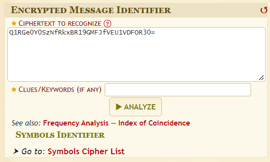
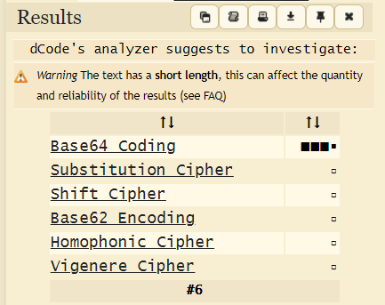
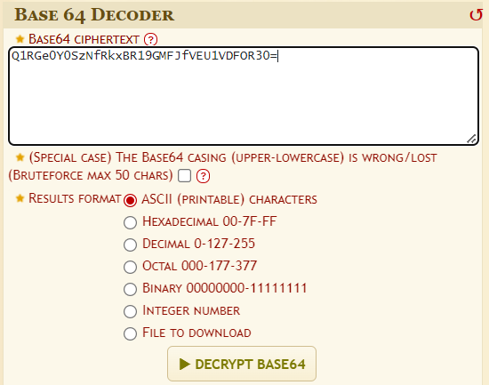
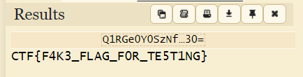

# Cryptography
Cryptography can be defined as the study and practice of techniques for modes of secure communication in the presence of malicious third parties. It involves formulating and maintaining protocols and algorithms to transform
a given ***plaintext*** (message to be hidden) into a secure ***ciphertext*** (the hidden message to be transmitted).

## The Bible - [dCode.fr](https://www.dcode.fr/en)

dCode.fr is a collection of over 800 tools to help solve games, riddles, ciphers, mathematics, puzzles, etc. The most useful tool for solving cryptography CTF challenges is the [Cipher Identifier](https://www.dcode.fr/cipher-identifier).

1. Enter the ciphertext in the identifier and click `ANALYZE`  
    
2. Choose the recommended encryption/encoding from the left ***Results*** bar, in this case `Base64 Coding`  
    
3. A new tab opens up for the selected encryption/encoding. Enter the same ciphertext again and click `DECRYPT BASE64`  
    
4. Wohoo! You will be able to see the decoded plaintext in the left ***Results*** bar  
  

## Additional Tools
- [Cryptii](https://cryptii.com/)
- [Boxentriq](https://www.boxentriq.com/code-breaking/cipher-identifier)
- [CyberChef](https://gchq.github.io/CyberChef/)