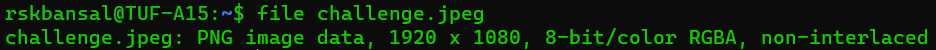

# Forensics
In a CTF context, Forensics involves any challenge which requires to examine and process a hidden piece of information out of static data files. It includes the following sub-categories:
- File Formats
- Image Analysis
- Steganography
- Audio Analysis

## File Formats
The first and the fore-most thing to check is the file format of the given file. You can use the `file` command to do the same.
```console
$ file <file_name>
```
